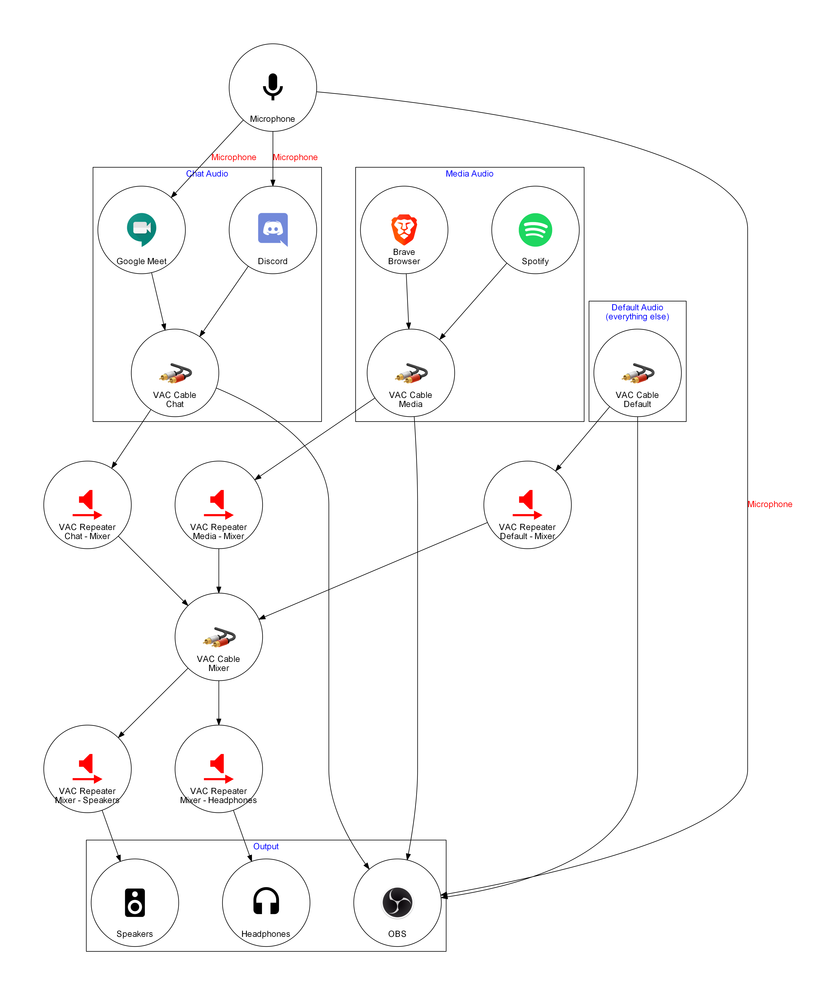
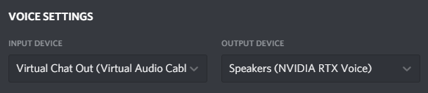
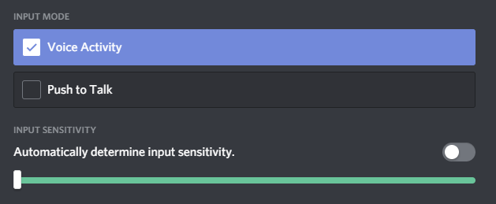
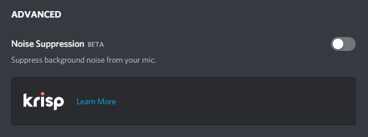
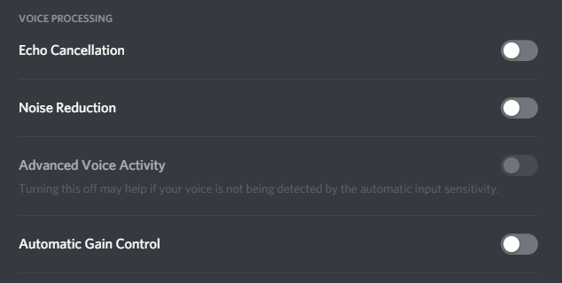
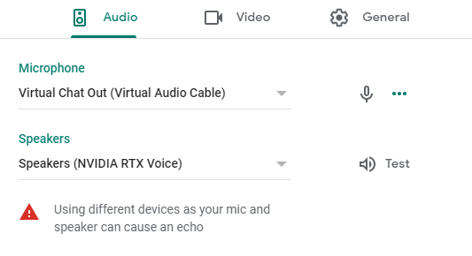

# Audio Configuration

> A multifunctional Windows audio configuration for streaming, voice chatting, gaming, playing guitar, etc.

## Audio Routing Graph



## Setup

- Ensure any audio device that will be connected to the virtual audio cables is configured to use a sample rate of 48000 Hz.
- Set up 6 Virtual Audio Cables in the VAC Control Panel (the default settings are fine).
- Go to the Windows audio properties panel and rename both the `Playback` and `Recording` components of the `Line x` audio devices as follows (best done device by device):

| Cable number | Old name | New name           |
| ------------ | -------- | ------------------ |
| 1            | Line 1   | Virtual Chat In    |
| 2            | Line 2   | Virtual Default    |
| 3            | Line 3   | Virtual Mixer      |
| 4            | Line 4   | Virtual Media      |
| 5            | Line 5   | Virtual Guitar     |
| 6            | Line 6   | Virtual Chat Out   |
| 7            | Line 7   | Virtual Soundboard |

- Install NVIDIA RTX Voice and configure it to use your physical microphone as its input device (to denoise your mic) and `Virtual Chat In` as its output device (to denoise incoming chat audio).
- Set `Virtual Default` to be your default device and default communication device under `Playback`
- Set `Virtual Chat Out` to be your default device and default communication device under `Recording`
- Go to `App volume and device preferences` under `Advanced sound options` in the Windows 10 settings app and configure any media player apps (e.g. Spotify) to output to `Virtual Media`
- Configure any voice chat apps to output incoming chat audio to `Speakers (NVIDIA RTX Voice)` and to use `Virtual Chat Out` as the microphone.
- Disable audio ducking in Windows

### Configure the audio setup to start with Windows

- Create a shortcut named `Start Audio Repeaters` with the following settings in its Shortcut tab:

| Field    | Value                                                                                                                              |
| -------- | ---------------------------------------------------------------------------------------------------------------------------------- |
| Target   | `C:\Windows\System32\WindowsPowerShell\v1.0\powershell.exe -Command "<path-to-the-directory-that-contains-this-readme>\start.ps1"` |
| Start in | `<path-to-the-directory-that-contains-this-readme>`                                                                                |
| Run      | Minimized                                                                                                                          |

- Copy/move the shortcut to `C:\ProgramData\Microsoft\Windows\Start Menu\Programs\StartUp`

### Discord

To configure Discord, there's a few settings to check.



Set the `Input Device` to `Virtual Chat Out (Virtual Audio Cable)` and the `Output Device` to `Speakers (NVIDIA RTX Voice)`.



If you're using the `Voice Activity` input mode, uncheck `Automatically determine input sensitivity` and drag the sensitivity slider all the way to the left to -100dB (the most sensitive). NVIDIA RTX Voice takes care of filtering out any noise, so we want every bit of audio it produces to trigger Discord's voice transmission.



Make sure Discord's noise suppression feature through Krisp is disabled for the same reason.



Disable all of Discord's voice processing settings (`Echo Cancellation`, `Noise Reduction`, `Advanced Voice Activity`, `Automatic Gain Control`).

### Google Meet



To configure Google Meet, set the `Microphone` to `Virtual Chat Out (Virtual Audio Cable)` and the `Speakers` to `Speakers (NVIDIA RTX Voice)`.

Note: the `Test` button produces a test tone that likely won't be audible if you have enabled `Remove background noise from incoming audio` in NVIDIA RTX Voice's settings, because it will be filtered out.

## Caveats

The Windows volume controls will not work for audio that is forwarded with the KS repeaters. My headset has a built-in volume knob that is processed in its firmware outside of Windows, so this is not an issue for me in my specific case. I can use a KS repeater to forward audio from the Virtual Mixer to my headset. If you need volume control, replace that KS repeater with an MME repeater. I need an MME repeater for my monitor speakers, for example.

RTX Voice must be running when the audio repeaters are started, otherwise the RTX audio devices won't exist.

## Legal

This project is licensed under CC BY-SA 4.0.

All product and company names and logos are trademarks™ or registered® trademarks of their respective holders. Use of them does not imply any affiliation with or endorsement by them.

### Image attribution
```
electric guitar by Juan Pablo Bravo from the Noun Project
```

