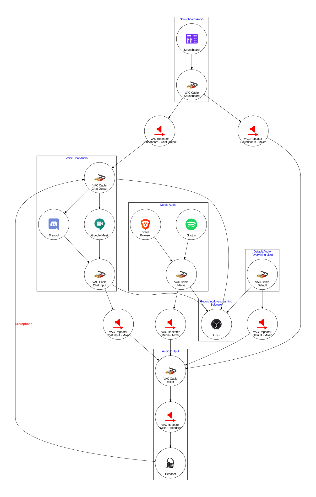
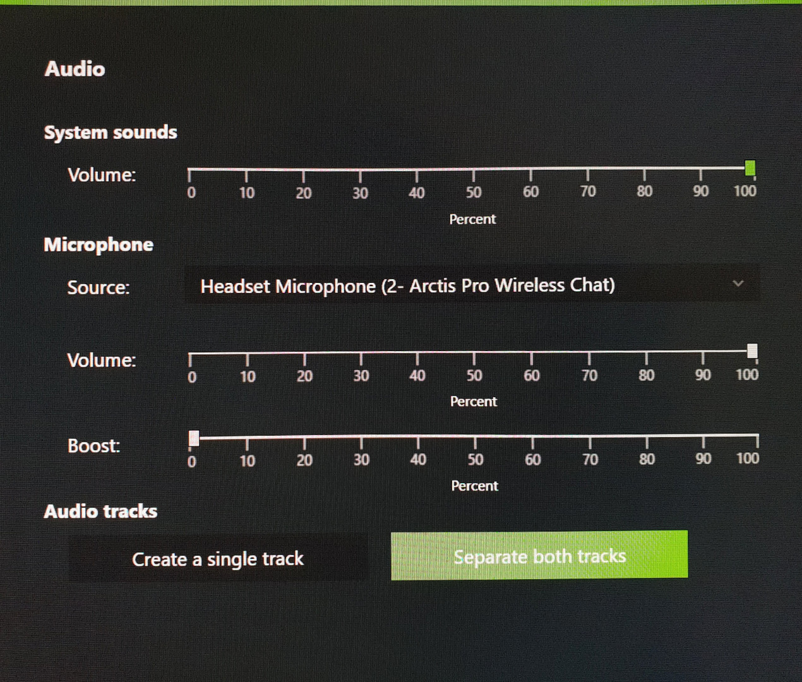
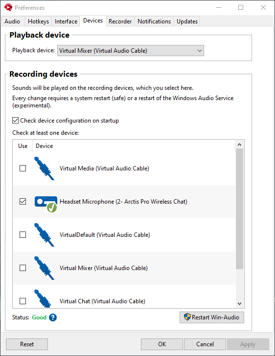

# Audio Configuration

> My personal Windows audio configuration for streaming, recording, discord, gaming, etc.

## Audio Routing Graph



## Setup

- Set up 4 Virtual Audio Cables in the VAC Control Panel (the default settings are fine).
- Go to the Windows audio properties panel and rename both the `Playback` and `Recording` components of the `Line x` audio devices as follows (best done device by device):

| Cable number | Old name | New name       |
| ------------ | -------- | -------------- |
| 1            | Line 1   | VirtualDefault |
| 2            | Line 2   | Virtual Mixer  |
| 3            | Line 3   | Virtual Media  |
| 4            | Line 4   | Virtual Chat   |

- Choose whether your want audio to be played through your headphones or speakers, then delete one of these config files and adjust the other:
  - Adjust the name of your headphones audio device in [`configs/[AR] Mixer - Headphones.cfg`](configs/[AR]%20Mixer%20-%20Headphones.cfg)
  - Adjust the name of your speakers audio device in [`configs/[AR] Mixer - Speakers.cfg`](configs/[AR]%20Mixer%20-%20Speakers.cfg)
- Adjust the sampling rate in all [configs](configs) files to match the sampling rate of the headphones or speakers you intend to use (to avoid costly and unnecessary [resampling](https://vac.muzychenko.net/en/manual/glossary.htm#FormatConversion))
- Set `VirtualDefault` to be your default device and default communication device under `Playback`
- Set your microphone to be your default device and default communication device under `Recording`
- Go to `App volume and device preferences` under `Advanced sound options` in the Windows 10 settings app and configure any media player apps (e.g. Spotify, your web browser) to output to `Virtual Media`
- Configure any voice chat apps to output incoming chat audio to `Virtual Chat`.
- Disable audio ducking in Windows

### Configure the audio repeaters to start when you login to Windows

- Create a shortcut named `Start Audio Repeaters` with the following settings in its Shortcut tab:

| Field    | Value                                                                                                                              |
| -------- | ---------------------------------------------------------------------------------------------------------------------------------- |
| Target   | `C:\Windows\System32\WindowsPowerShell\v1.0\powershell.exe -Command "<path-to-the-directory-that-contains-this-readme>\start.ps1"` |
| Start in | `<path-to-the-directory-that-contains-this-readme>`                                                                                |
| Run      | Minimized                                                                                                                          |

- Copy/move the shortcut to `%appdata%\Microsoft\Windows\Start Menu\Programs\Startup`

### Configure [NVIDIA Shadowplay](https://www.nvidia.com/en-eu/geforce/geforce-experience/shadowplay/) audio settings

- Set your microphone as the microphone source
- Under `Audio tracks`, enable the `Separate both tracks` option



Note that Shadowplay will always record "game audio" from whatever the default playback device is (`VirtualDefault` in our case). As far as I can tell there is currently no way to change this, so unfortunately we can't have a separate virtual cable exclusively for game audio.

### Configure [Soundpad](https://leppsoft.com/soundpad)

- Set your `Playback device` to `Virtual Mixer` instead of `Virtual Default`. This prevents Soundpad sounds doubling up in recordings.
- Under `Recording devices`, enable only your microphone.



### Create a restart shortcut

Create a shortcut with the following options.

Target:

```
C:\Windows\System32\WindowsPowerShell\v1.0\powershell.exe -Command "PATH_TO_AUDIO_CONFIG_PROJECT_DIR\restart.ps1"
```

Start in:

```
PATH_TO_AUDIO_CONFIG_PROJECT_DIR
```

Run:

```
Minimized
```

Icon:

```
PATH_TO_AUDIO_CONFIG_PROJECT_DIR\vac_audio_repeater_restart.ico
```

I would recommend dragging this shortcut to your Windows taskbar so you can easily access it in case the audio gets crackly for some reason.

## Troubleshooting

- The VAC audio repeaters are a bit finicky when it comes to the names of the audio devices they'll accept.
  The name of an audio device must not end in a space when truncated to 31 characters, otherwise the device won't be found (VAC 4.66).
  You'll have to rename the audio device somewhat creatively to work around it if you encounter this problem.
- If you (or the people you speak with) notice crackling, popping, or other audio distortion, you can analyze possible causes with [LatencyMon](https://www.resplendence.com/latencymon)

## Legal

This project is licensed under CC BY-SA 4.0.

All product and company names and logos are trademarks™ or registered® trademarks of their respective holders. Use of them does not imply any affiliation with or endorsement by them.

### Image attribution

```
microphone, speaker, headphones icons by Material Design Icons
```
