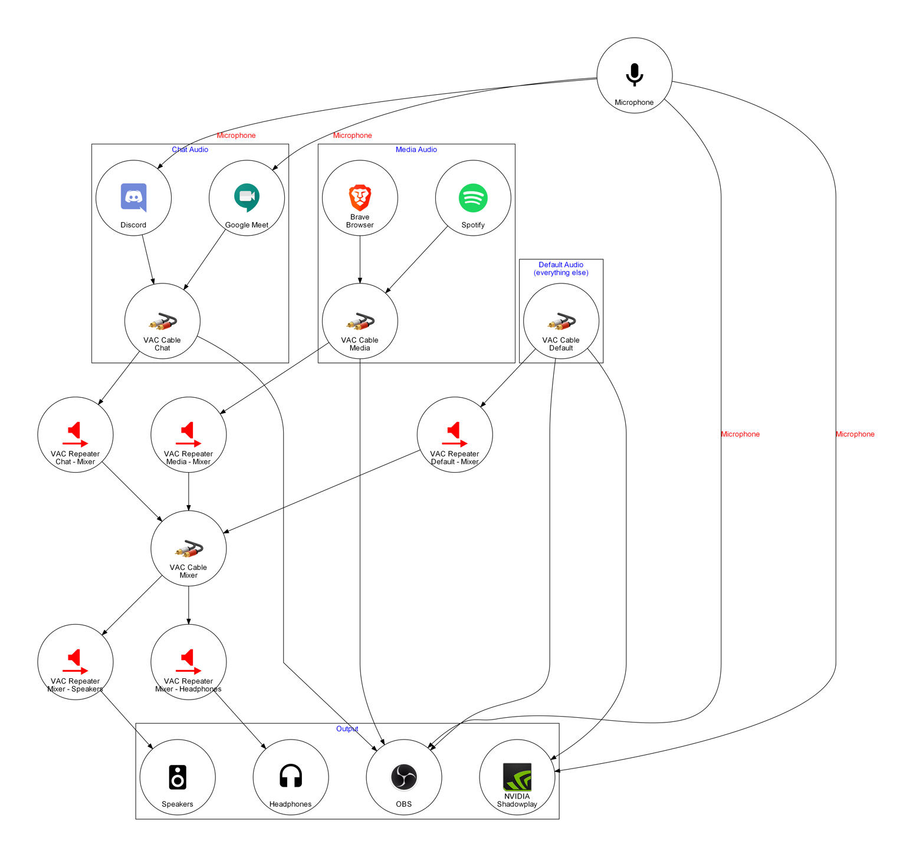

# Audio Configuration

> A multifunctional Windows audio configuration for streaming, recording, voice chatting, gaming, using a soundboard, etc.

## Audio Routing Graph



## Setup

- Ensure any audio device that will be connected to the virtual audio cables is configured to use a sample rate of 48000 Hz. TODO: check if still necessary for non-KS repeaters
- Set up 6 Virtual Audio Cables in the VAC Control Panel (the default settings are fine).
- Go to the Windows audio properties panel and rename both the `Playback` and `Recording` components of the `Line x` audio devices as follows (best done device by device):

| Cable number | Old name | New name            |
| ------------ | -------- | ------------------- |
| 1            | Line 1   | VirtualDefault      |
| 2            | Line 2   | Virtual Mixer       |
| 3            | Line 3   | Virtual Media       |
| 4            | Line 4   | Virtual Soundboard  |
| 5            | Line 5   | Virtual Chat Input  |
| 6            | Line 6   | Virtual Chat Output |

- Set `VirtualDefault` to be your default device and default communication device under `Playback`
- Set `Virtual Chat Output` to be your default device and default communication device under `Recording`
- Go to `App volume and device preferences` under `Advanced sound options` in the Windows 10 settings app and configure any media player apps (e.g. Spotify) to output to `Virtual Media`
- Configure any voice chat apps to output incoming chat audio to `Virtual Chat Input` and to use `Virtual Chat Output` as the microphone.
- Disable audio ducking in Windows

### Configure the audio setup to start with Windows

- Create a shortcut named `Start Audio Repeaters` with the following settings in its Shortcut tab:

| Field    | Value                                                                                                                              |
| -------- | ---------------------------------------------------------------------------------------------------------------------------------- |
| Target   | `C:\Windows\System32\WindowsPowerShell\v1.0\powershell.exe -Command "<path-to-the-directory-that-contains-this-readme>\start.ps1"` |
| Start in | `<path-to-the-directory-that-contains-this-readme>`                                                                                |
| Run      | Minimized                                                                                                                          |

<!-- TODO: shouldn't this be in my user dir somewhere? -->

- Copy/move the shortcut to `C:\ProgramData\Microsoft\Windows\Start Menu\Programs\StartUp`

### Discord

To configure Discord, there's a few settings to check.


Set the `Input Device` to `Virtual Chat Output (Virtual Audio Cable)` and the `Output Device` to `Virtual Chat Input (Virtual Audio Cable)`.


<!-- TODO: update these instructions to remove RTX voice -->

If you're using the `Voice Activity` input mode, uncheck `Automatically determine input sensitivity` and drag the sensitivity slider all the way to the left to -100dB (the most sensitive). NVIDIA RTX Voice takes care of filtering out any noise, so we want every bit of audio it produces to trigger Discord's voice transmission.


Make sure Discord's noise suppression feature through Krisp is disabled for the same reason.


Disable all of Discord's voice processing settings (`Echo Cancellation`, `Noise Reduction`, `Advanced Voice Activity`, `Automatic Gain Control`).

### Google Meet


To configure Google Meet, set the `Microphone` to `Virtual Chat Output (Virtual Audio Cable)` and the `Speakers` to `Virtual Chat Input (Virtual Audio Cable)`.

## Troubleshooting

- The audio repeaters are a bit finicky when it comes to the names of the audio devices they'll accept.
  The name of an audio device must not end in a space when truncated to 31 characters, otherwise the device won't be found (VAC 4.66).
  You'll have to rename the audio device somewhat creatively to work around it if you encounter this problem.
- If you (or the people you speak with) notice crackling, popping, or other audio distortion, you can analyze possible causes with [LatencyMon](https://www.resplendence.com/latencymon)

## Legal

This project is licensed under CC BY-SA 4.0.

All product and company names and logos are trademarks™ or registered® trademarks of their respective holders. Use of them does not imply any affiliation with or endorsement by them.

### Image attribution

```
electric guitar by Juan Pablo Bravo from the Noun Project
soundboard by Parker Foote from the Noun Project
```
